# JNX03 Portfolio Website

> **Personal website and portfolio of Chawabhon Netisingha** - Technology Innovation Leader, AI Developer, and Project Manager specializing in accessibility technology and artificial intelligence solutions.

[](https://jnx03.xyz)
[](https://nextjs.org/)
[](https://www.typescriptlang.org/)
[](https://tailwindcss.com/)

## 🌟 About

This is the source code for my personal portfolio website showcasing my work in artificial intelligence, accessibility technology, and innovative software development. The site features interactive elements, responsive design, and comprehensive project documentation.

### Key Features

- **🎨 Modern Design**: Clean, professional interface with dark/light theme support
- **⚡ Performance Optimized**: Built with Next.js 15 and optimized images
- **♿ Accessibility First**: Full W3C compliance and screen reader support
- **🌍 Internationalization**: Multi-language support system
- **📱 Responsive**: Mobile-first design that works on all devices
- **🔍 SEO Optimized**: Structured data and meta tags for better search visibility

## 🏆 Featured Projects & Achievements

### EibrailleNext - Accessibility Learning Platform
Award-winning platform for teaching Braille to blind and low-vision users featuring:
- Advanced face recognition technology
- Comprehensive curriculum management
- Full accessibility compliance
- **Awards**: Intel Global Impact Challenge, ISEF 2025, PETRA Samsung Award, Thailand ICT Awards

### Personal Recognition
- **Swift Student Challenge 2025 Winner** - Apple Inc.
- **AI Innovator Award 2024** - Technology Innovation Council
- **APICTA Merit Award 2023** - Asia Pacific ICT Alliance

## 🛠️ Technology Stack

- **Frontend**: Next.js 15, React 19, TypeScript
- **Styling**: Tailwind CSS, Framer Motion, Radix UI
- **Performance**: Vercel Analytics, Speed Insights
- **Tools**: Cloudinary (Image Optimization), React Hook Form
- **Development**: ESLint, PostCSS, Autoprefixer

## 🚀 Getting Started

### Prerequisites

- Node.js 18+ 
- pnpm (recommended) or npm

### Installation

```bash
# Clone the repository
git clone https://github.com/JNX03/JNX03.git
cd JNX03

# Install dependencies
pnpm install

# Start development server
pnpm dev

# Build for production
pnpm build
```

### Available Scripts

```bash
pnpm dev      # Start development server
pnpm build    # Build for production
pnpm start    # Start production server
pnpm lint     # Run ESLint
```

## 📁 Project Structure

```
├── app/                    # Next.js App Router pages
│   ├── (home)/            # Homepage components
│   ├── blog/              # Blog posts and articles
│   ├── projects/          # Project showcases
│   ├── contact/           # Contact form
│   └── api/               # API routes
├── components/            # Reusable React components
│   ├── ui/                # UI component library
│   └── *.tsx              # Custom components
├── lib/                   # Utility functions and configurations
├── public/                # Static assets
└── styles/                # Global styles
```

## 🎯 Key Pages

- **Homepage** (`/`): Personal introduction, featured projects, and achievements
- **Projects** (`/projects`): Comprehensive portfolio of development work
- **Blog** (`/blog`): Technical articles and project insights
- **Contact** (`/contact`): Professional contact form with email integration
- **Awards** (`/awards`): Detailed awards and recognition showcase

## 🌐 Connect & Explore

[](https://jnx03.xyz)
[](https://www.linkedin.com/in/chawabhon-netisingha-4a60a034a/)
[](https://github.com/JNX03)
[](https://www.instagram.com/jxxn03z/)
[](https://www.youtube.com/@Jnx03)
[](https://www.kaggle.com/jxxn03x)
[](https://huggingface.co/Jnx03)

## 📈 GitHub Metrics

<table>
  <tr>
    <td colspan="2">
      <a href="https://github.com/lowlighter/metrics">
        
      </a>
    </td>
  </tr>
  <tr>
    <td></td>
    <td></td>
  </tr>
  <tr>
    <td></td>
    <td></td>
  </tr>
  <tr>
    <td></td>
    <td></td>
  </tr>
</table>

## 📄 License

This project is open source and available under the [MIT License](LICENSE).

---

<p align="center">
  <strong>Building innovative technology solutions that create meaningful impact</strong><br>
  Chawabhon Netisingha - Technology Innovation Leader & AI Developer
</p>
