# Hi there 👋
**Welcome to JNX03's GitHub Profile!** 🚀

---

## 📊 Metrics

### Additional Metrics

<!-- Isometric commit calendar -->

<!-- Most used languages -->

<!-- Lines of code changed -->

<!-- Achievements -->

<!-- Recently starred repositories -->

<!-- Followers information -->

---

## 📬 Connect with Me

---
